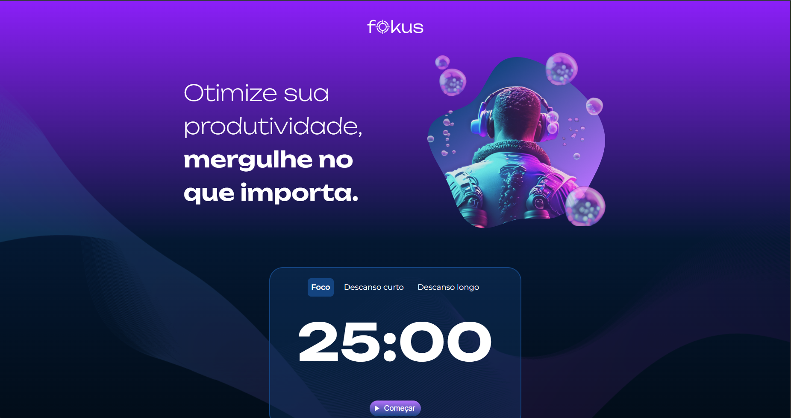

# Fokus

> Projeto com objeto de criar um time, utilizando-se de JavaScript (Elementos DOM) para manipulação

---

## 📸 Preview do Projeto

<!-- Opção 1: Imagem centralizada usando HTML (Recomendado para controlar tamanho) -->
<p align="center">
  
</p>

<!-- Opção 2: Sintaxe Markdown simples (Caso não queira centralizar)
 
-->

---

## 🛠️ Tecnologias Utilizadas

Este projeto foi desenvolvido utilizando as seguintes ferramentas e tecnologias:

*   **[JavaScript]**

---

## ⚙️ Como Executar o Projeto

Siga os passos abaixo para rodar o projeto localmente em sua máquina.

### Pré-requisitos
Antes de começar, você vai precisar ter instalado em sua máquina:
*   [Git](https://git-scm.com)
*   [Node.js](https://nodejs.org)

### Passo a Passo

1. Clone este repositório:
   ```bash
   git clone https://github.com/rdg-404/Fokus.git
   ```

2. Rode localmente pelo VScode usando GoLive

---


Desenvolvido durante curso de **Manipulação de elementos na DOM** da **Alura**


